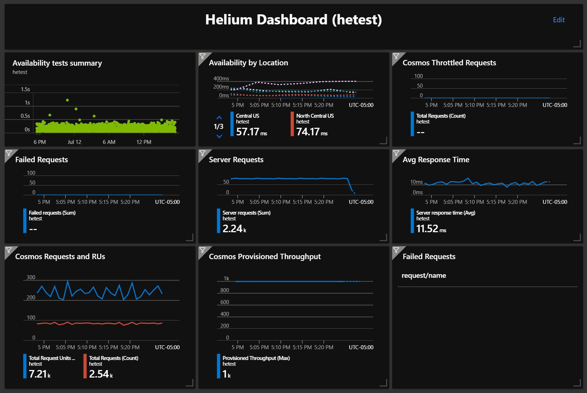

# Azure App Service Observability

## Smoke Test setup

Deploy [Web Validate](https://github.com/retaildevcrews/webvalidate) to drive consistent traffic to the App Service for monitoring and alerting. Use the `debug` image if you need to connect to the container to debug any latency or network issues.

```bash

# Add Log Analytics extension
az extension add -n log-analytics

# create Log Analytics for the webv clients
az monitor log-analytics workspace create -g $He_WebV_RG -l $He_Location -n $He_Name -o table

# retrieve the Log Analytics values using eval $He_LogAnalytics_*
export He_LogAnalytics_Id='az monitor log-analytics workspace show -g $He_WebV_RG -n $He_Name --query customerId -o tsv'
export He_LogAnalytics_Key='az monitor log-analytics workspace get-shared-keys -g $He_WebV_RG -n $He_Name --query primarySharedKey -o tsv'

# save the environment variables
./saveenv.sh -y

# create Azure Container Instance running webv
az container create -g $He_WebV_RG --image retaildevcrew/webvalidate:latest -o tsv --query name \
-n ${He_Name}-webv-${He_Location} -l $He_Location \
--log-analytics-workspace $(eval $He_LogAnalytics_Id) --log-analytics-workspace-key $(eval $He_LogAnalytics_Key) \
--command-line "dotnet ../webvalidate.dll --tag $He_Location -l 1000 -s https://${He_Name}.azurewebsites.net -u https://raw.githubusercontent.com/retaildevcrews/${He_Repo}/main/TestFiles/ -f benchmark.json -r --json-log"

# create in additional regions (optional)
az container create -g $He_WebV_RG --image retaildevcrew/webvalidate:latest -o tsv --query name \
-n ${He_Name}-webv-eastus2 -l eastus2 \
--log-analytics-workspace $(eval $He_LogAnalytics_Id) --log-analytics-workspace-key $(eval $He_LogAnalytics_Key) \
--command-line "dotnet ../webvalidate.dll --tag eastus2 -l 10000 -s https://${He_Name}.azurewebsites.net -u https://raw.githubusercontent.com/retaildevcrews/${He_Repo}/main/TestFiles/ -f benchmark.json -r --json-log"

az container create -g $He_WebV_RG --image retaildevcrew/webvalidate:latest -o tsv --query name \
-n ${He_Name}-webv-westeurope -l westeurope \
--log-analytics-workspace $(eval $He_LogAnalytics_Id) --log-analytics-workspace-key $(eval $He_LogAnalytics_Key) \
--command-line "dotnet ../webvalidate.dll --tag westeurope -l 10000 -s https://${He_Name}.azurewebsites.net -u https://raw.githubusercontent.com/retaildevcrews/${He_Repo}/main/TestFiles/ -f benchmark.json -r --json-log"

az container create -g $He_WebV_RG --image retaildevcrew/webvalidate:latest -o tsv --query name \
-n ${He_Name}-webv-southeastasia -l southeastasia \
--log-analytics-workspace $(eval $He_LogAnalytics_Id) --log-analytics-workspace-key $(eval $He_LogAnalytics_Key) \
--command-line "dotnet ../webvalidate.dll --tag southeastasia -l 10000 -s https://${He_Name}.azurewebsites.net -u https://raw.githubusercontent.com/retaildevcrews/${He_Repo}/main/TestFiles/ -f benchmark.json -r --json-log"

# create ACI running the debug webv image (optional)
az container create -g $He_WebV_RG --image retaildevcrew/webvalidate:debug -o tsv --query name \
-n ${He_Name}-webv-${He_Location}-debug -l $He_Location \
--log-analytics-workspace $(eval $He_LogAnalytics_Id) --log-analytics-workspace-key $(eval $He_LogAnalytics_Key) \
--command-line "dotnet run -- --tag $He_Location -l 1000 -s https://${He_Name}.azurewebsites.net -u https://raw.githubusercontent.com/retaildevcrews/${He_Repo}/main/TestFiles/ -f benchmark.json -r --json-log"

# connect to the debug webv container instance for further debugging (as needed)
az container exec -g $He_WebV_RG -n ${He_Name}-webv-${He_Location}-debug --exec-command "/bin/bash"

```

### Sample Queries

Click on the 'Logs' item in the Log Analytics sidebar menu and run the `ContainerInstanceLog_CL` query to view all Azure Container Instance logs. Each log message consists of the following fields:

- category - Type of request
- path - Path to web API resource
- tag - Tag associated when running Web Validate. For the smoke tests, this is the location where you created the ACI
- statusCode - Status code from the test run
- duration - Duration of the test
- quartile - Based on the test duration
- logType - Type of message, either request or summary
- contentLength - Content length of test response
- errorCount - Number of errors encountered running the test

Refer to the Log Analytics Kusto Query Language (KQL) [overview](https://docs.microsoft.com/en-us/azure/data-explorer/kusto/query/) for further information on creating queries.

```bash

# Get 10 most recent log entries
ContainerInstanceLog_CL | top 10 by TimeGenerated

# Unpack all fields of Message object into columns
ContainerInstanceLog_CL
| extend jsonMessage = parsejson(Message)
| extend category = tostring(jsonMessage.category),
  path = tostring(jsonMessage.path),
  tag = tostring(jsonMessage.tag),
  code = toint(jsonMessage.statusCode),
  duration = toint(jsonMessage.duration),
  quartile = toint(jsonMessage.quartile),
  logType = tostring(jsonMessage.logType),
  length = toint(jsonMessage.contentLength),
  errors = toint(jsonMessage.errorCount)

# Failed or error tests
ContainerInstanceLog_CL
| extend jsonMessage = parsejson(Message)
| extend errors = toint(jsonMessage.errorCount),
  code = toint(jsonMessage.statusCode)
| where code != 200 or errors > 0

# Test runs exceeding 2000ms
ContainerInstanceLog_CL
| extend jsonMessage = parsejson(Message)
| extend duration = toint(jsonMessage.duration)
| where duration > 2000

# Average duration of tests per category and location
ContainerInstanceLog_CL
| extend jsonMessage = parsejson(Message)
| extend category = tostring(jsonMessage.category),
  duration = toint(jsonMessage.duration),
  tag = tostring(jsonMessage.tag)
| where isnotempty(category)
| summarize avg(duration) by category, tag
| sort by category

# Average quartile of tests per category and location
ContainerInstanceLog_CL
| extend jsonMessage = parsejson(Message)
| extend category = tostring(jsonMessage.category),
  quartile = toint(jsonMessage.quartile),
  tag = tostring(jsonMessage.tag)
| where isnotempty(category)
| summarize avg(quartile) by category, tag
| sort by category

# Tests with duration exceeding the 98th percentile within the matching category
ContainerInstanceLog_CL
| extend jsonMessage = parsejson(Message)
| extend category = tostring(jsonMessage.category),
  duration = toint(jsonMessage.duration)
| join kind=leftouter (
    ContainerInstanceLog_CL
    | extend jsonMessage = parsejson(Message)
    | extend category = tostring(jsonMessage.category),
      duration = toint(jsonMessage.duration)
    | where isnotempty(category)
    | summarize percentile(duration, 98) by category
  )
  on category
| where duration > percentile_duration_98
| project category, duration, jsonMessage

```

Run the queries directly in command line

```bash

az monitor log-analytics query -w $(eval $He_LogAnalytics_Id) \
--analytics-query "ContainerInstanceLog_CL | top 10 by TimeGenerated"

```

## Dashboard setup

Replace the values in the `Helium_Dashboard.json` file surrounded by `%%` with the proper environment variables
after making sure the proper environment variables are set (He_Sub, He_App_RG, Imdb_RG and Imdb_Name)

```bash

curl -s https://raw.githubusercontent.com/retaildevcrews/helium/master/docs/dashboard/Helium_Dashboard.json > Helium_Dashboard.json
sed -i "s/%%SUBSCRIPTION_GUID%%/$(eval $He_Sub)/g" Helium_Dashboard.json
sed -i "s/%%He_App_RG%%/${He_App_RG}/g" Helium_Dashboard.json
sed -i "s/%%Imdb_RG%%/${Imdb_RG}/g" Helium_Dashboard.json
sed -i "s/%%Imdb_NAME%%/${Imdb_Name}/g" Helium_Dashboard.json
sed -i "s/%%He_Repo%%/${He_Name}/g" Helium_Dashboard.json

```

Navigate to the ([dashboard](https://portal.azure.com/#dashboard)) within your Azure portal. Click upload and select the `Helium_Dashboard.json` file that you have created.

## Example Dashboard



More [information](https://docs.microsoft.com/en-us/azure/azure-portal/azure-portal-dashboards) on creating and sharing dashboards.
