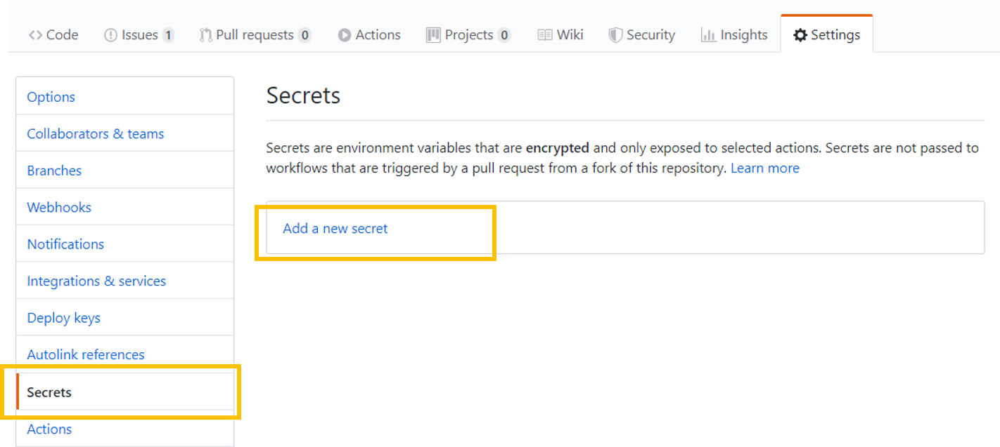

# Setup CI-CD with Github Actions

Setup Github Actions to build and push the helium container to Azure Container Registry (ACR) and Docker hub.

## Prerequisites

### Create Service Principal for ACR Push

First, create a Service Principal and grant it ACR push access using the Azure CLI.

```bash

# source environment variables from before if needed
# based off of $He_Name value
source ~/{youruniquename}.env

# create a Service Principal
export He_SP_PWD_CICD=$(az ad sp create-for-rbac -n http://${He_Name}-acr-sp-cicd --query password -o tsv)
export He_SP_ID_CICD=$(az ad sp show --id http://${He_Name}-acr-sp-cicd --query appId -o tsv)
export He_SP_TENANT_CICD=$(az ad sp show --id http://${He_Name}-acr-sp-cicd --query appOwnerTenantId -o tsv)
# get the Container Registry Id
export He_ACR_Id=$(az acr show -n $He_Name -g $He_ACR_RG --query "id" -o tsv)

# assign acrpush access to Service Principal
az role assignment create --assignee $He_SP_ID_CICD --scope $He_ACR_Id --role acrpush

# show SP values needed to set up Github Action
echo $He_SP_ID_CICD
echo $He_SP_PWD_CICD

```

### Create a Docker hub User account and Create Personal Access Token

ADD STEPS HERE

### Set up Secrets in GitHub Action workflows

[GitHub Secrets](https://help.github.com/en/actions/automating-your-workflow-with-github-actions/creating-and-using-encrypted-secrets) are encrypted and allow you to store sensitive information, such as access tokens, in your repository.

You could use GitHub secrets to store your Azure Credentials, Publish profile of your Web app, container registry credentials or any such sensitive details which are required to automate your CI/CD workflows using GitHub Actions.

#### Creating secrets

1. On GitHub, navigate to the main page of the repository.
1. Under your repository name, click on the "Settings" tab.
1. In the left sidebar, click Secrets.
1. On the right bar, click on "Add a new secret"
   
1. Type a name for your secret in the "Name" input box.
1. Type the value for your secret.
1. Click Add secret.
   

The following secrets are required for the workflow to run:

* DOCKER_USER  - your dockerhub user name
* DOCKER_PAT   - the personal access token for dockerhub
* SERVICE_PRINCIPAL  - your SP Client ID that has ACR Push IAM role - the value of $He_SP_ID_CICD
* SERVICE_PRINCIPAL_PASSWORD   - the personal access token for the SP Client id - the value of $He_SP_PWD_CICD
* TENANT  - The tenant ID of the subscription of the ACR - the value of $He_SP_TENANT_CICD

## Workflow Properties

The workflow used in this project allows for images to be created for testing when a PR is created and Images for Production use when a Commit is tagged with a version via git tags.

### Add Github Workflow File (.yml)

1. Create a new branch in your forked repo off of master.
2. Copy the [dockerByPR.yml](./dockerByPR.yml) and the [dockerCI.yml](./dockerCI.yml) files from this folder to your forked repo in the .github/workflows directory. If the .github folder does not already exist at the root, create one.

### Update dockerByPR

1. On line 21, replace the name of your Docker Hub registry and image name you want to use. So for helium-csharp you could use `DOCKER_REPO: 'mydockerreg/helium-csharp'`
2. On lines 73-75, replace the alues of `ACR_REG`, `ACR_REPO` and `ACR_IMAGE` with the values for the ACR created for the environment.
3. Merge changes into master through a pull request.

### Update dockerCI

1. On line 25, replace the name of your Docker Hub registry and image name you want to use. So for helium-csharp you could use `DOCKER_REPO: 'mydockerreg/helium-csharp'`
2. On lines 88-91, replace the values of `ACR_REG`, `ACR_REPO` and `ACR_IMAGE` with the values for the ACR created for the environment.
3. Merge changes into master through a pull request.

## Verify Successful Workflow

1. Commit your changes to your branch and push your branh to your forked repo.
2. Create a PR to master based on your branch.
3. After making the PR, navigaet to the Actions tab on your repo.
4. You should see and instance of the newly added `dockerByPR` running or successfully completed.
5. Once the PR run was successful you can now merge your PR into master.
6. After merging changes into master, navigate to the Actions tab in your repo.
7. You should see an instance of the newly added workflow (It will show as Docker Image Build) running or succesfully completed.


