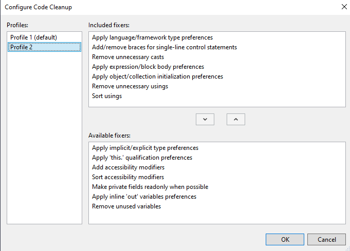

# Engineering Practices

## Definition of Done

- Execute code cleanup task in Visual Studio
- Code changes reviewed & signed off
- Existing documentation is updated (readme, .md's)
- New documentation needed to support the change is created
- Code changes checked into main
- All existing automated tests (unit and/or e2e) pass successfully, new tests added as needed
- CI completes successfully
- CD completes successfully
- Smoke test production deployment for minimum of 2 weeks
- New changes in smoke test for 48hrs (ongoing)
- Create task for required artifacts

Engineering Playbook [Definition of Done](https://github.com/microsoft/code-with-engineering-playbook/tree/master/agile-development/team-agreements/definition-of-done/readme.md)

## Markdown (md files)

- Use [markdownlint](https://marketplace.visualstudio.com/items?itemName=DavidAnson.vscode-markdownlint) add-in for VS Code
  - Repeating header lint issues are OK if avoiding would cause readability issues
- Use [Code Spell Checker](https://github.com/streetsidesoftware/vscode-spell-checker) add-in for VS Code
- Use `-` for unordered lists
  - Mixing `-` and `*` will cause linter errors
- Use single back-quote to `call out terms`
- Add a blank line before and after ''' for visualization
- ''' blocks must specify a language for color coding
- Preview the MD to make sure it renders in a highly readable format
  - Avoid long headers, especially H1 and H2
    - Using a short Hx with a long call out renders better than a long Hx

> Use call outs to emphasize important points

## Query Strings

TypeScript is case sensitive on query string parameters

> All query string parameters should be camelCase

## Code cleanup (Visual Studio)

Visual Studio 2019 includes a code cleanup feature which contains two profiles, each with their own configurable "fixers". The following instructions describe the steps necessary to configure "Profile 2" with the correct fixers.

> Note: A code cleanup should be run before a PR is ready for review

### Configure Profile 2 Fixers

1. From within Visual Studio 2019 click the **Analyze** menu
2. Choose **Code Cleanup** then choose **Configure Code Cleanup**
3. Click **Profile 2** and click the down icon/button to remove any existing fixers.
4. Add the following fixers (order does not matter):

## Tool for Code Reviews

- CodeFlow extension for GitHub [Link](https://www.1eswiki.com/wiki/CodeFlow_integration_with_GitHub_Pull_Requests)

## Kanban Board Management Best Practices

### Triage

> All net-new issues need to be triaged, leverage Notes for discussions points as needed

- Create the issue in the appropriate repo with the appropriate template
- Add project to the issue (i.e. Helium) - this will add to the main board
  - This is only necessary in a multi-repo project like Helium
- Add all relevant tags (language, enhancement, bug, design review, etc)
- Do not add Size, Priority, Milestone, or Assignee
- All issues will be triaged at the end of the Standup call
- Add an "undo issue" for any temporary changes that need to be removed in the future

### Backlog

> Once issue has been triaged, move into the Backlog

- Once issue is triaged, add the appropriate priority label and other tags as appropriate
- Do not add size, milestone or assignee

### Sprint Backlog

> Issues identified during milestone planning will be shifted into Milestone backlog

- Need to review and update priority and add estimated sizing and milestone labels

### In Progress

> Issues that the Dev Team is actively working on

- Add assignee, size, and milestone tags & ensure all relevant tags are added
- If a design review is required, schedule meeting when moving issue to backlog
- If task is bigger than "Size:L", break into smaller tasks to ensure completion during week sprint

### PR Submitted / Review

> Pull Requests to create or update code, documentation, templates, etc and issues that need reviewed

- Complete the PR Template (ensure original issue is closed or referenced)
- Assign reviewers, assign yourself, add Project board, and Milestone
- If issue has multiple issue to close and/or reference, report each reference/close # on separate line to ensure correct link

### Done

- Issue is completed, no further action required
- Ensure task checklist is complete

### Burn Down

> During the final sprint of the milestone, create a burn down column for issues pivotal to achieve goals
